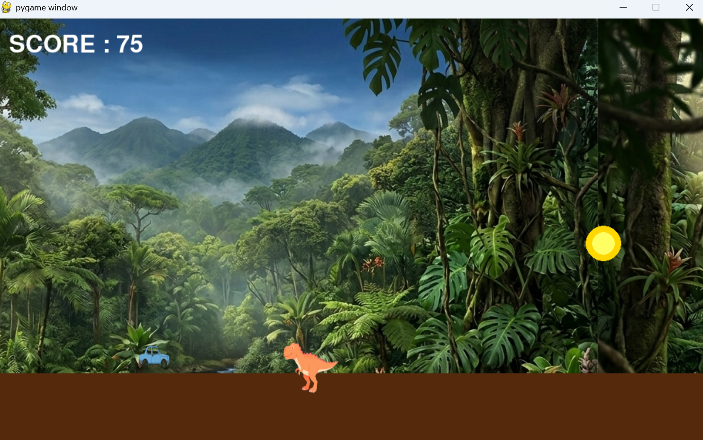

# Jurassic Run (ジュラシックラン)

 

## 実行環境の必要条件
* python >= 3.10
* pygame >= 2.1

## ゲームの概要
* 移動する車をジャンプ操作するアクションゲーム

## ゲームの遊び方
* スペースキーで車をジャンプ操作することで障害物の恐竜を避け、ハイスコアを目指す
* 障害物に当たったらゲームオーバーとなる

## ゲームの実装
### 共通基本機能
* 自動横スクロール、SPACEジャンプ、重力、障害物、当たり判定、GAME OVER

### 分担追加機能

* ステージギミック(動く障害物・穴)：担当　福田禅：上下に動く障害物とそのままの障害物落とし穴をランダムに出るようにした。落とし穴を三マスあけてそこに落ちたらゲームオーバーになるようにした。
* アイテム(スコアを増やすコイン)：担当　加藤駿太：獲得するとスコアを100増やすアイテムを追加。
* 一時停止・再開・リスタート機能：担当　濱野駿夢：Pキーでポーズ画面。ポーズ画面からRキーで再開、Tキーで最初からやり直し。ゲームオーバー画面にRキーでリスタートできる機能を追加。
* プレイヤーギミック(二段ジャンプ・ターボ)：担当　木塚竜ノ介：ターボを使用するにはスコアを消費する
* エフェクト・サウンド・デザイン系：担当　肥田颯雅：背景、bgm、ジャンプ効果音導入。背景をロールするよう変更。

### ToDo
- 
- 
### メモ
*背景ロールがどう影響するか
* 
* 
